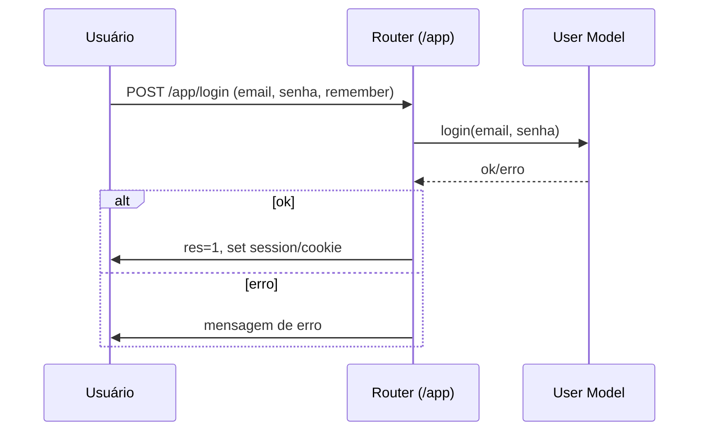
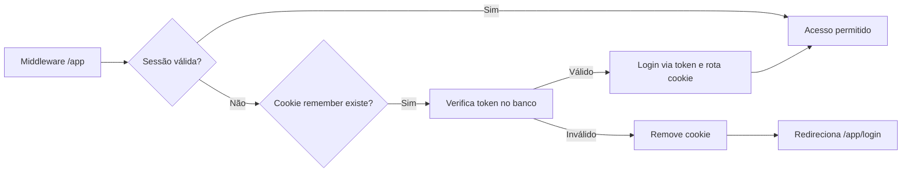
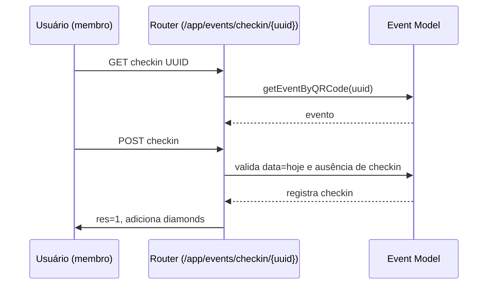

# Canal Salto Alto — Descritivo do Sistema

## 1. Visão Geral Arquitetural
- Monólito em PHP com front controller (`index.php`) e roteamento via `bramus/router`.
- Camada de “modelo” composta por classes em `application/src` (ex.: `User`, `Company`, `Event`, `Content`, `Post`, `Membership`, etc.), com acesso a banco via `PDO` centralizado em `DB`.
- Camada de “visão” em `views`, separada em `site`, `app` (área de membros) e `admin`, além de templates reutilizáveis em `views/templates`.
- Sessões são usadas para autenticação e autorização, com suporte a “manter conectado” via token persistido em cookies.
- Recursos estáticos em `assets` (SCSS/CSS, fontes, ícones). Entrega e cache configurados via `.htaccess`.
- Integrações externas para pagamentos, notificações push, e mensageria (WhatsApp).

Arquitetura de requisição:
```mermaid
flowchart LR
  A[Navegador] --> B{Apache .htaccess}
  B -->|Rewrite| C[index.php]
  C --> D[Router (bramus/router)]
  D --> E[Rotas: site.php, app.php, admin.php, ...]
  E --> F[Modelos (application/src)]
  F --> G[(MySQL via PDO)]
  E --> H[Views (views/*)]
  E --> I[Templates (views/templates)]
  C --> J[Composer / Autoload]
```

## 2. Módulos e Componentes Principais
- `application/src/DB.php`:
  - Abre conexão `PDO` com MySQL. Ponto central de acesso ao banco.
- `application/src/User.php`:
  - CRUD de usuários, autenticação com senha, “remember token”, verificação de associação/membership e contagens agregadas.
  - Referências: criação `application/src/User.php:6`, login `application/src/User.php:395`, token remember `application/src/User.php:425`, contagens e listagens `application/src/User.php:551`.
- `application/src/Company.php`:
  - CRUD de empresas, listagem e paginação, filtros por status e categoria, relacionamento com membership do dono.
  - Referências: listagem `application/src/Company.php:3`, criação `application/src/Company.php:286`, atualização `application/src/Company.php:374`.
- `application/src/Event.php`:
  - CRUD de eventos, geração de `slug` e `qrcode_uuid`, check-in de membros, consultas por slug e QRCode.
  - Referências: criação `application/src/Event.php:1`.
- `application/src/Content.php`:
  - CRUD de conteúdos, comentários, slug, paginação e relacionados.
  - Referências: criação `application/src/Content.php:15`, comentários `application/src/Content.php:124`.
- `application/src/Post.php`:
  - Blog/notícias: CRUD, listagem/paginação, comentários e slug.
  - Referências: criação `application/src/Post.php:17`, atualização `application/src/Post.php:55`, comentários `application/src/Post.php:137`.
- `application/src/Membership.php`:
  - Operações de membership/assinaturas vinculadas a usuários.
  - Referências: consulta pagas `application/src/Membership.php:29`.
- `application/src/Coupon.php`:
  - CRUD e validações de cupons de desconto (usado no admin).
- `application/src/Banner.php`:
  - CRUD de banners (posições desktop/mobile, ordem, status).
- `application/src/Media.php`:
  - Gestão de mídias (metadados, alt, etc.).
- `application/src/Upin.php`:
  - Utilitário de upload de arquivos (verificação de extensão/tamanho, criação de diretórios).
  - Referências: execução `application/src/Upin.php:66`.
- `application/src/Template.php`:
  - Renderização de templates phtml com `extract` e buffer.
  - Referências: `application/src/Template.php:4`.
- `application/src/Logger.php`:
  - Registro de logs em tabela `csa_logs` com nível e mensagem.
  - Referências: `application/src/Logger.php:5`.
- `application/src/Comunications.php`:
  - Envio de e-mails via PHPMailer (SMTP).
  - Referências: `application/src/Comunications.php:7`.
- `application/src/PushNotification.php`:
  - Notificações push (OneSignal) com payload customizável.
  - Referências: `application/src/PushNotification.php:1`.
- `application/src/EvolutionAPI.php`:
  - Envio de mensagens de texto via API externa (WhatsApp).
  - Referências: `application/src/EvolutionAPI.php:1`.
- `application/src/Checkout.php`:
  - Criação de pedidos via Pagar.me (API v5/v6), prepara e envia payload.
  - Referências: `application/src/Checkout.php:1`.

## 3. Fluxos de Trabalho e Interações
- Autenticação (App/Admin):
  - Fluxo de login valida e, se sucesso, popula sessão (`csa_email`, `csa_password`).
  - “Manter conectado”: cookie `csa_remember` com `email:token`, token validado/rotacionado.
  - Referências: middleware de proteção `routes/app.php:2`, login `routes/app.php:63`, remember `routes/app.php:5`, logout `routes/app.php:98`; admin `routes/admin.php:16`.

- Recuperação de senha:
  - Gera token temporário, envia e-mail e mensagem WhatsApp com link, valida token e atualiza senha.
  - Referências: geração `routes/app.php:117`, persistência `application/src/User.php:926`, validação `application/src/User.php:934`.
- Membership e Diamonds:
  - Membership vinculado ao usuário com status/intervalo, usado para autorizar áreas.
  - Sistema de “diamantes” (pontos) adicionados por ações (comentário, check-in).
  - Referências: diamonds `application/src/User.php:199`, membership checks `application/src/User.php:303`.
- Conteúdos e comentários:
  - Listagem/paginação, leitura por slug, comentários moderados.
  - Referências: rotas `routes/app.php:219`, `routes/app.php:228`, comentários `routes/app.php:240`.
- Empresas:
  - CRUD e aprovação, visível no guia público com paginação e filtro por categoria.
  - Referências: rotas app `routes/app.php:307`, site `routes/site.php:41`, admin `routes/admin.php:1531`.
- Eventos e Check-in com QR:
  - Evento com `qrcode_uuid`, check-in autorizado apenas no dia do evento.
  - Referências: checkin `routes/app.php:565`, QR no admin `routes/admin.php:913`.
- Publis (conteúdo de membros):
  - Criação/edição, likes, comentários, aprovação no admin.
  - Referências: app `routes/app.php:634`, admin `routes/admin.php:1743`.
- Checkout:
  - Páginas de planos, validações, recaptcha e integração com Pagar.me.
  - Referências: `routes/checkout.php`.
- Exportações (Admin):
  - Exporta membros para Excel usando PhpSpreadsheet.
  - Referências: `routes/admin.php:1203`.

## 4. Dependências Externas e Bibliotecas
- `bramus/router`: roteamento HTTP. Uso em `index.php:24` e `routes/*`.
- `guzzlehttp/guzzle`: disponível, não observado em uso direto nos trechos analisados.
- `pagarme/pagarme-php`: integração de pagamentos (também há cliente cURL direto).
- `phpmailer/phpmailer`: envio de e-mails (`Comunications`).
- `endroid/qr-code`: geração de QR no admin para eventos.
- `onesignal/onesignal-php-api`: notificações push via OneSignal (há wrapper próprio `PushNotification`).
- `phpoffice/phpspreadsheet`: exportar dados para `.xlsx`.

## 5. Padrões de Codificação e Convenções
- Rotas definidas de forma declarativa com closures, separadas por contexto (`site`, `app`, `admin`).
- Modelos são classes simples que:
  - Validam/normalizam dados com `filter_var`, `preg_replace`, `intval`, `ucfirst/trim`.
  - Usam `PDO::prepare` com parâmetros nomeados para evitar SQL injection.
- Autenticação:
  - Hash de senha com `Bcrypt` (`application/src/Bcrypt.php`).
  - Sessões e cookies com `httponly`; token “remember” armazenado com `sha256` no banco.
- Uploads:
  - `Upin` abstrai múltiplos uploads, checa extensão e tamanho, cria diretórios `uploads/YYYY/MM`.
- Views:
  - Organização por contexto; templates phtml em `views/templates` via `Template::render`.
- Logging:
  - `Logger::log(level, message, userId)` insere em tabela dedicada.

## 6. Estrutura de Diretórios
- Raiz:
  - `index.php`, `.htaccess`, `README.md`, `OneSignalSDKWorker.js`
  - `assets/` — SCSS/CSS, fontes e ícones.
  - `application/` — código PHP e dependências:
    - `autoload.php`, `composer.json`, `composer.lock`
    - `src/` — classes de domínio e utilitários.
    - `vendor/` — pacotes Composer.
  - `views/`:
    - `site/` — páginas públicas.
    - `app/` — área de membros.
    - `admin/` — painel administrativo.
    - `templates/` — parciais e templates phtml.
  - `routes/` — definição de rotas (`site.php`, `app.php`, `admin.php`, `checkout.php`, `pagarme.php`, `webhook.php`, `track.php`).

## 7. Configurações Importantes e Variáveis de Ambiente
- `.htaccess`:
  - Força HTTPS, front controller (`index.php`), cache estático agressivo e compressão.
- `index.php:7` define `PATH` com a URL base do site.
- Conexão de banco, SMTP e chaves de APIs estão codificadas nas classes (`DB`, `Comunications`, `EvolutionAPI`, `Checkout`, reCAPTCHA em `routes/checkout.php`).
  - Recomendação: externalizar credenciais para variáveis de ambiente e carregar via `dotenv` (ex.: `vlucas/phpdotenv`) ou configs por ambiente.
  - Separar configurações por `dev`, `test` e `prod`.

## 8. Diagramas Relevantes
Autorização em `/app`:


Check-in de evento:


---

### Exemplos Pontuais (com referências)
- Front controller e registro de rotas: `index.php:24-42`.
- Proteção de rotas da área de membros com middleware: `routes/app.php:2-50`.
- Login e “manter conectado”: `routes/app.php:63-96` e `application/src/User.php:425-468`.
- Renderização de e-mail com template: `application/src/Template.php:4` e uso em `routes/app.php:141-145`.
- Exportar planilha de membros: `routes/admin.php:1203-1253`.
- Upload de imagens: uso de `Upin` em múltiplas rotas (ex.: `routes/admin.php:492`).

---

## Processo de Geração e Atualização
- Análise estática e mapeamento por arquivos/classes.
- Identificação de padrões e arquitetura aplicada.
- Este documento foi gerado com base no estado atual do repositório e deve ser versionado junto ao projeto.
- Recomenda-se atualização contínua a cada mudança de rotas, modelos ou integrações externas.

## Reflexão sobre Escalabilidade e Manutenibilidade
- A arquitetura atual é pragmática e direta para um monólito PHP, mas credenciais embutidas e lógica de domínio misturada em rotas (closures extensos) podem dificultar testes, reuso e segurança. Externalizar configurações sensíveis para variáveis de ambiente, introduzir camadas de serviço (intermediárias entre rotas e modelos) e padronizar validações reduziria acoplamento e facilitaria evolução.
- Para escalar, considerar: desacoplar uploads e notificações em serviços; consolidar autenticação num módulo dedicado; padronizar respostas JSON e códigos de erro; fortalecer observabilidade (logs estruturados com correlação de requisição); e dividir arquivos que excedem 200–300 linhas, seguindo o princípio de coesão e separação de responsabilidades. O uso de `composer` permite introduzir `phpdotenv`, testes automatizados e linters sem fricção.

